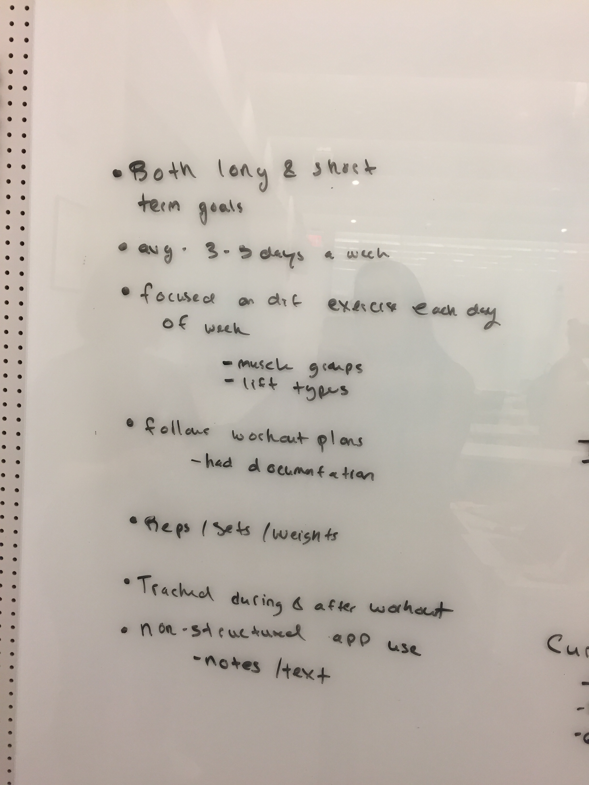
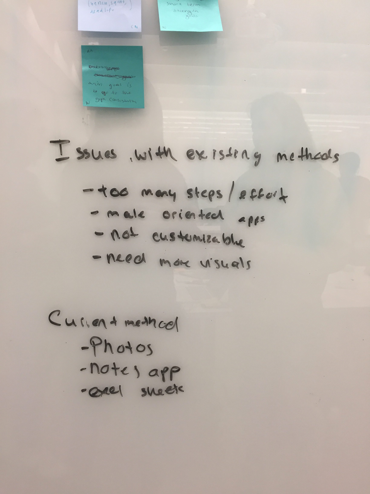
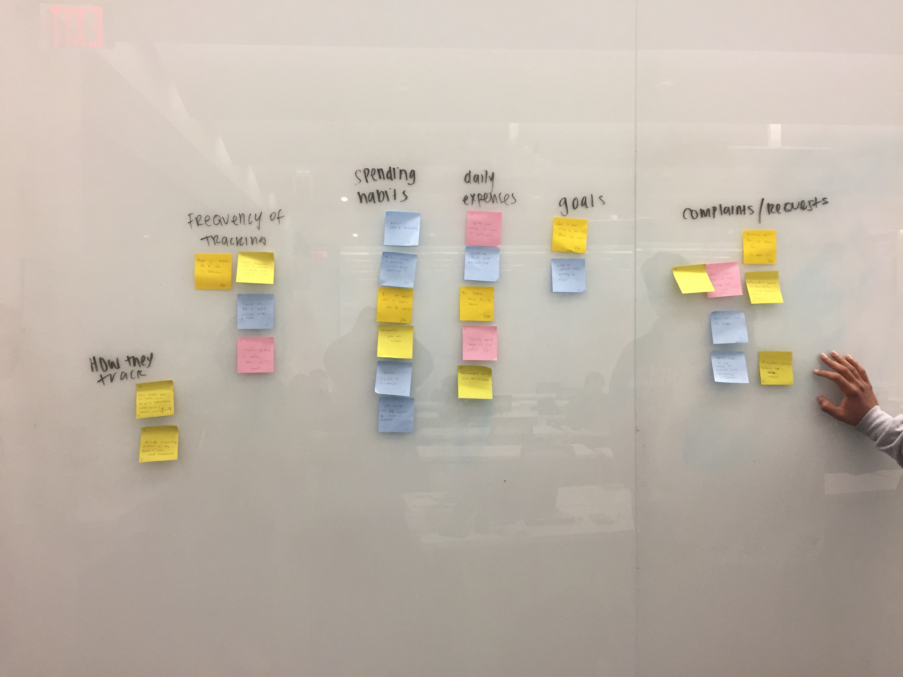
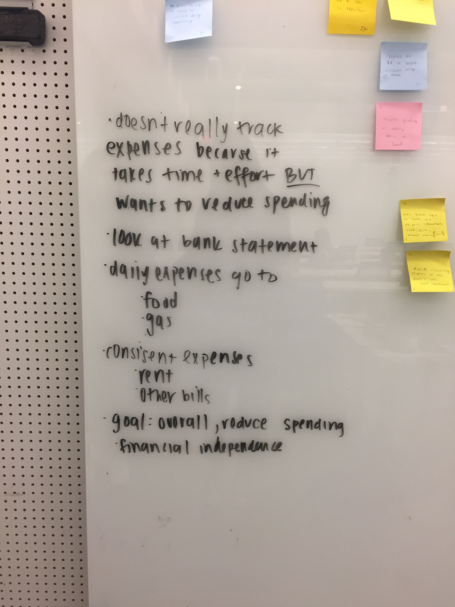

# Milestone 2: Gathering Information & Planning
As per the assignment, our product is a general tracking app. 

## Updated Target Users
We identified three (3) target users for this app to be:
1. Students who want to reach strength goals through exercise.
2. Students who want to reduce everyday finance spending and meet specific budgeting goals.
3. Students who want to reduce their time spent on social media to be productive.

We chose these target users because they are easily accessible on a college campus, and we hypothesize the users' target desires are common problems among students.

## Research Methods

We conducted **user interviews** with students who want to reach *strength goals* and *reduce everyday finances*. Interview-style data collection allowed us to learn about the users' personal experiences and perspectives with these intentional and measureable activites. 

On the other hand, we conducted **field studies** with our users who wanted to *reduce time spent on social media*. We chose this method rather than an interview because users often do not meausre and are unaware of time they spend on social media. 

### Interviews
Our interview questions and user responses are required in the following links:

* [Strength Goals Interviews](interviews/fitness.md)
* [Finance Goals Interviews](interviews/finance.md)
* [Social Media Field Studies](interviews/socialmedia.md)

## Analysis
We affinity diagramed our data to sort and narrow down information we gathered from users. 

### Strength Tracking

From those wanting to track strength/fitness progress, we learned:
1. Users follow pre-made workout plans throughout their workouts and log progress during and after sessions.
2. Users mainly use text to record data through basic apps such as Notes or Excel.
3. Users have issues with fitness apps that:
		- Have too many steps
		- Are not customizable
		- Lack visuals (diagrams, photos, etc).

**Affinity Diagram**

**Notes**

### Finance Tracking

From those wanting to track everyday finances, we learned:
1. Users *do* want to reduce spending, but many fail to do so because tracking finances takes time and effort.
2. To check spending, users look at their bank statements.
3. Users' overall goal is to gain financial independence.

**Affinity Diagram**

**Notes**

### Social Media Use

From watching users use social media, we learned:
1. When studying, users keep social media and academic tabs open at the same time on their laptop browswers.
2. If somebody near the user opened social media or checked their phone, the user would do the same.
3. Users check social media for a few minutes at a time, many times throughout the session. 

**Affinity Diagram**

**Notes**

## Value Propositions
After analysis, we decided that our application will provide users: 
* A method of tracking progress passively and without much overhead
* A method to more easily visualize / manipulate quantitative data
* A central hub that is customizable for use in different areas (ex. can track both eating and exercise in one place)
* A solution that is easily accessible on preferred devices 
* Consistent reminders to help users understand their progress

## Personas

### Fitness Tracking – John
* John is a male junior at Cornell University. 
* He’s SUPER into fitness and wants to stay in shape for health and aesthetics. He maintains both long a short term exercise goals, but more specifically, he wants to be able to: bench 260 lbs, deadlift 450 lbs, and squat 325 lbs within the year.
* He also uses exercise as a way to destress, so he is very religious about exercise. 
* He follows a strict regimen and goes to the gym 3–5 times a week. 
* Each workout is focused around a different muscle group or exercise type.
* He plans out his routine before going to the gym and and keeps the routine on a Notes app on his phone, which he looks at throughout his workout.
* He tracks his progress (number of reps/sets/weight) during the workout. He also takes time to reflect on it afterward with notes.
* He takes photos before and after his workout sessions twice a week.

#### Obstacles
* He used to use a workout app, but he found it too restricting and cumbersome because it wasn’t customizable to his own needs and the app was not easy to use.
* He has trouble visualizing his progress because he has no way to go through quantitative data (the lifting weight progress).

#### Needs/Desires
* Data visualization of progress over time
* Customizable and adaptable, yet simple, tracker. A better way to work with the data
* Something to help calculate RPE
* Calculate how much you should be lifting
* Incorporate diet into tracking

### Finance Tracking – David
* David is a senior at Cornell University who is having a crisis because he is graduating soon.
* He is a reckless spender and is worried about financial independence after college.
* He has a job, but he spends his paycheck really fast.
* David has financial support from his parents and they keep him afloat; they give him an allowance, but they expect him to be independent post-college.
* He tries to budget in his head, but always overspends.
* He occasionally looks at his bank statement but usually loses track.

#### Obstacles
* David overspends on food. He buys a lot of pre-made food or food from restaurants. He doesn’t really go to the grocery store to make his own food
* David buys a coffee every morning from Starbucks
* He never has a clear idea of how much money he is spending every day/week
* David also drives a car so he has to pay for gas.

#### Needs/Desires
* David wants to track his spending on a week-to-week basis.
* He wants to save money for when he graduates
* He wants to plan a budget for the short and long term
* David wants to eliminate frivolous spending
		* He considers important spending as groceries and gas
		* He considers frivolous spending as coffee every morning and expensive meals
* David wants to be reminded of his spending
* Wants to save for the long-term

### Social Media Use – Nicole
* Nicole is female sophomore at Cornell majoring in Computer Science.
* Most of her classes are big lectures.
* She LOVES Apple; she’s got an iPhone, Mac, iPencil, iPad, Apple Watch, Beats… and she brings them with her everywhere.
* She takes notes on her laptop but always has her phone closeby in her lap or pocket.
* Nicole likes to scroll on Facebook and Instagram while she uses FB Messenger and iMessage to chat with her friends.

#### Obstacles
* Social Media activities and multitasking distract Nicole from taking notes or paying attention in lecture.
* During lecture she tends to multitask by keeping many tabs/apps open. She likes to scroll.
* Nicole has FOMO and never wants to miss out on anything her friends are doing/talking about.
* However, her grades are dropping because she never knows what’s going on in class.
She needs a better way to focus. 

#### Needs/Desires
* Nicole wants to get better grades, so she needs to pay attention in class and while studying.
* Nicole realizes she gets distracted and wants to stop and wants to establish goals to reduce her social media usage.
* She wants a way to resolve her phone anxiety, where she gets anxious when she can’t respond to people.

## Scenarios

### Fitness – John
John is a weightlifter who practices his bench press, deadlift, and squat 4 times a week.  While he’s made tremendous progress, he still falling short of his summer goals, so he’s trying to track his weightlifting progress to keep him on a strict regimen.

While he’s working out, John inputs the reps, weight, and sets of each exercise he completes into the Tracker app.  To check how much progress he made, he has the app display a chart visualizing the changes in these values for each lift over the past month. With a visual representation of the progress he’s making, John feels confident he’ll reach his goal as he planned. 

### Finance – David
David has a job at GreenStar where he earns $11 an hour. He doesn’t work many hours (8 per week) so his paychecks aren’t very heavy. He also gets paid every two weeks which means he is often anxiously waiting for payday.

During the day, David has to choose where to go out for lunch. He is used to going to his favorite places which are pricey, but he checks his Tracker app to see if he can afford it today. The app tells him that he is very close to going over his weekly budget, so he chooses a cheaper, healthier alternative instead. 

### Social Media - Nicole
Nicole is sitting in CS 2110 lecture on her laptop. It’s October and she’s nervous because her project grades so far were not up to her standards, and she has her first prelim coming up. 

Nicole uses Google Docs in Chrome to take notes. Although she is tempted to open all of her favorite social media websites in tabs next to her Doc, she refrains because her Tracking app notifies her how many social media minutes she has racked up so far, and that she is in class and should not be on those websites.

## Project Themes
To avoid feature-creep, we have decided the following most important features for our tracker:
* Customizability - allow users to determine what kind of data is being recorded
* Data Visualization - offer users the option to organize and display their data in a multitude of ways
* Responsiveness - create an interface that supports user needs on both mobile and desktop
* Progress Feedback - incorporate reminders for support and goal reaching, along with preventative warnings

