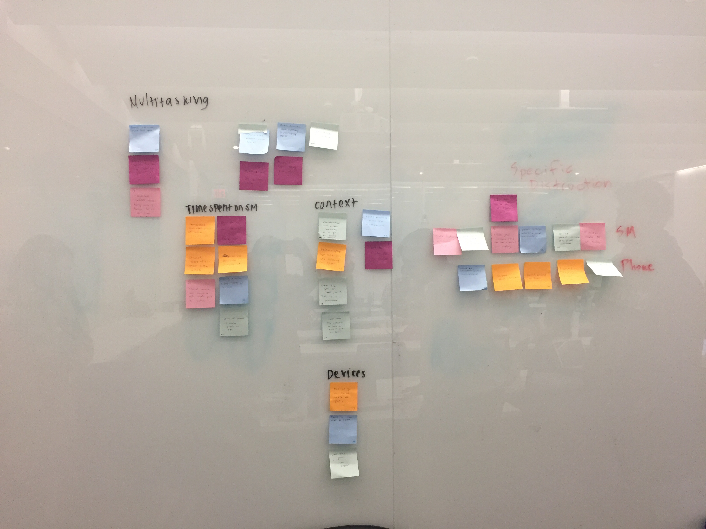

# Milestone 2: Gathering Information & Planning
As per the assignment, our product is a general tracking app. 

## Updated Target Users
We identified three (3) target users for this app to be:
1. Students who want to reach strength goals through exercise.
2. Students who want to reduce everyday finance spending and meet specific budgeting goals.
3. Students who want to reduce their time spent on social media to be productive.

We chose these target users because they are easily accessible on a college campus, and we hypothesize the user target desires are common problems among students.

## Research Methods

We conducted **user interviews** with students who want to reach strength goals and reduce everyday finance. Interview-style data collection made the most sense because we wanted to learn about the users' personal experiences and perspectives with these intentional and more easily-measureable activites. 

On the other hand, we conducted **field studies** with our users who wanted to reduce time spent on social media. This data-collection method was better than an interview because users often do not know how much time they already spend on social media. 

* [Strength Goals Interviews](interviews/fitness.md)
* [Finance Goals Interviews](interviews/finance.md)
* [Social Media Field Studies](interviews/socialmedia.md)

## Analysis
We affinity diagramed our data to sort and narrow down information we gathered from users. 

### Strength 

*Affinity Diagram*

*Notes*

### Finance 

*Affinity Diagram*

*Notes*

### Social Media 

*Affinity Diagram*

*Notes*

## Personas

## Scenarios

## Value Propositions
Our application will provide users: 
* A method of tracking progress passively and without much overhead
* A method to more easily visualize / manipulate quantitative data
* A central hub that is customizable for use in different areas (ex. can track both eating and exercise in one place)
* A solution that is easily accessible on preferred devices 
* Consistent reminders that help users understand their progress

## Project Themes
* Customizability - allow users to determine what kind of data is being recorded
* Data Visualization - offer users the option to organize and display their data in a multitude of ways
* Responsiveness - create an interface that supports user needs on both mobile and desktop
* Progress Feedback - incorporate reminders for support and goal reaching, along with preventative warnings

