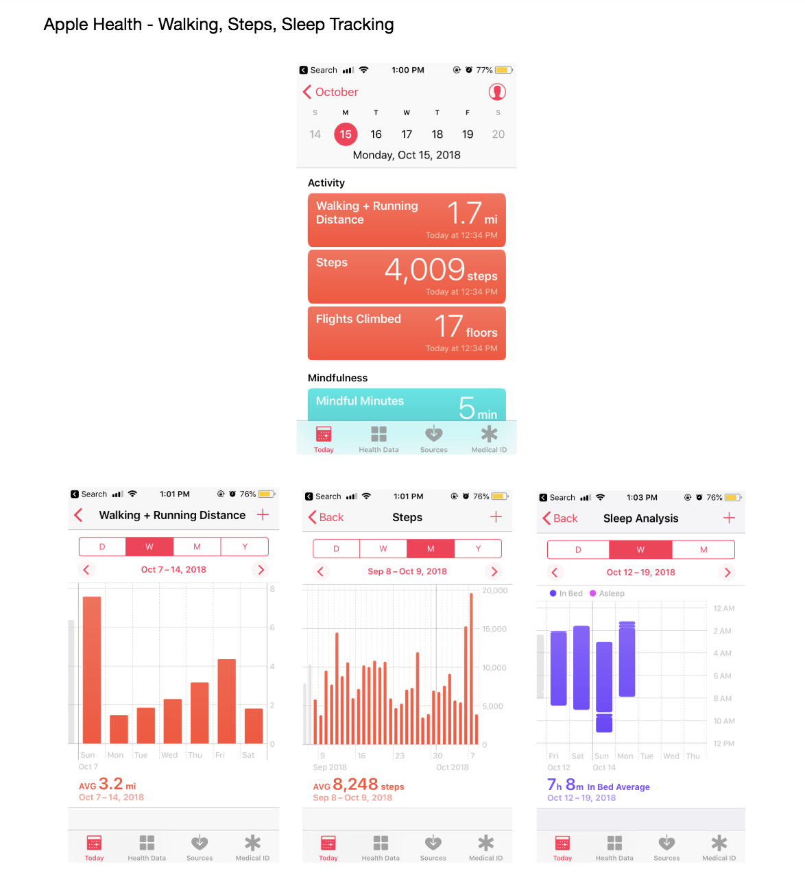
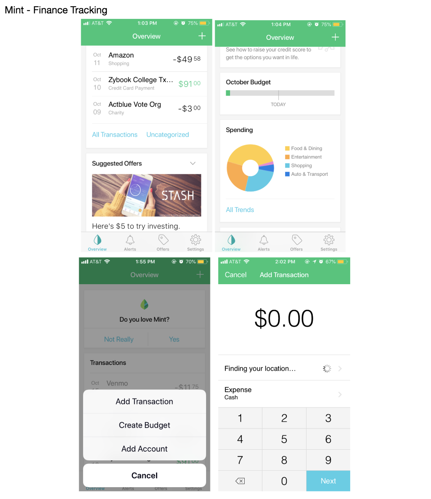
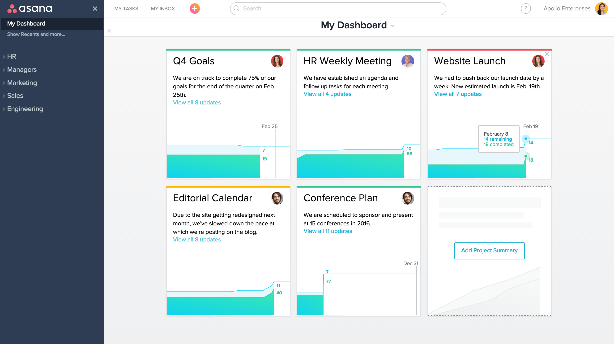
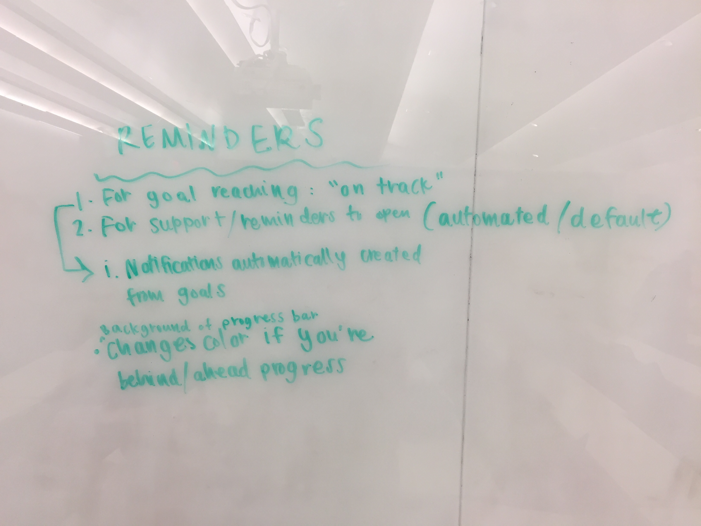
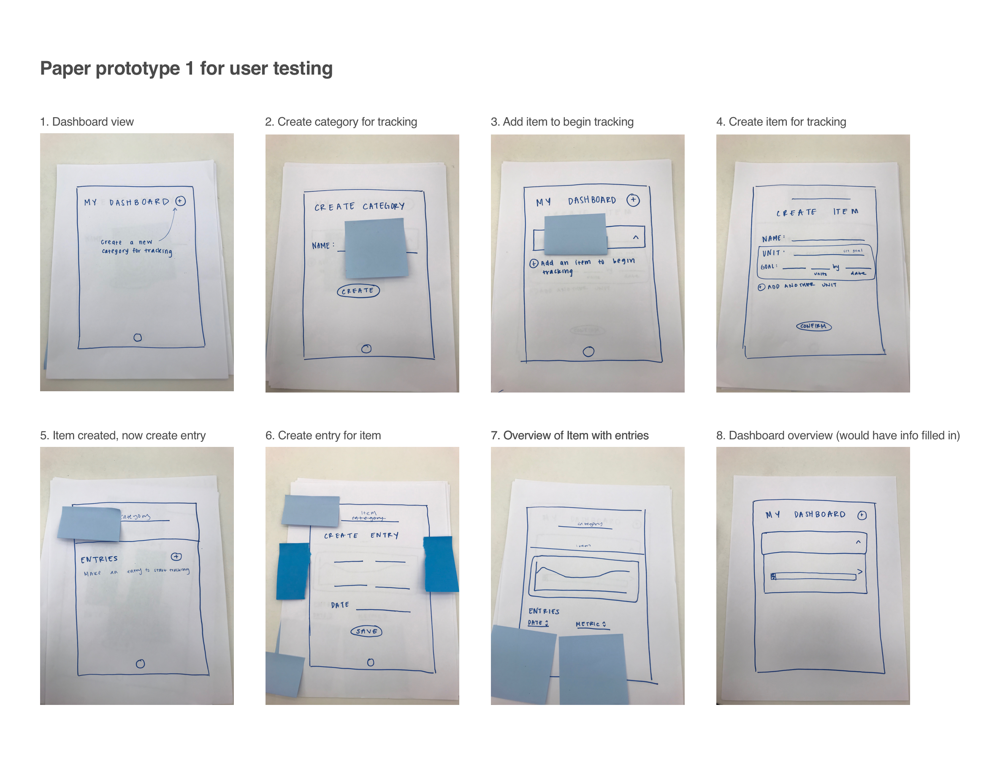
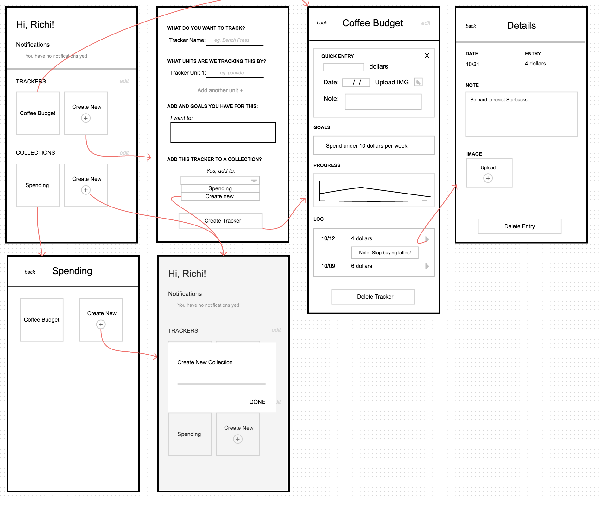

# Milestone 3: Design

## Brainstorming

To conduct our brainstorming, we aggregated ideas and conducted market research. Some of our raw ideas and mentions included concepts like:

 * Daily Dashboard
   * Tile format 
   * Each tile is expandable 
   * Like blackboard announcements
 * Way to compartmentalize different kinds of things to track when you initially download the app 
   * Topics Grids
 * Can be used to track multiple things → Accessible toggle
   * Variables + subvariables 
 * Is customizable yet not complicated → Not too many options, or ability to add more options/fields
   * Reminder toggle
   * User sets when to receive 
 * Visualizes quantitative data
   * Line Charts (weight use over time) 
 * Do we let them choose the chart (Bar, circle, line)?
    * Increment/Decrement with arrows 
    * Show targets 
 * Something you can take notes with
   * Allows entries
   * Sticky Notes/Google Keep	
   * Sticky Note per each separate topic 
   * Can customize each sticky note

### Inspiration
We drew inspiration from pre-existing mobile and desktop applications where users have to keep track of information.

Asana Dashboard (Desktop)

Google Drive Folders

Instagram Collections

## Sketches

## Prototyping

### Low-Fidelity Prototype

We tested our paper prototype with five people from our target group. 
After testing, we found we need to:
1. Improve the language of our app. 
	- Our language of "categories" and "items" were ambiguous and our users were not sure of what to input. 
	- The conversational style of our application was too robotic/formal.
2. Add more navigational buttons, like "back" and "edit" buttons.
3. Make the flow less heavy.
	- Users felt it took too many clicks to input tracking. They had to create a category, create an item, and then an entry.

We also learned that users did not care that much about creating goals. They were satisfied with tracking progress and inputting data, but creating goals to meet were not as important.

### Wireframes

## Rationale

## Revisions

