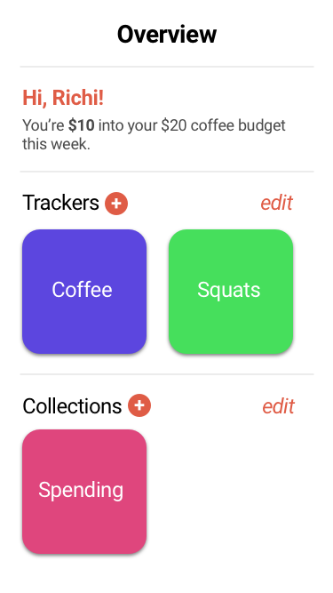
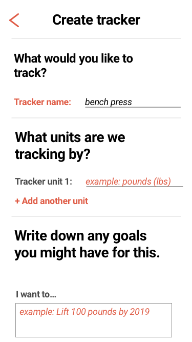
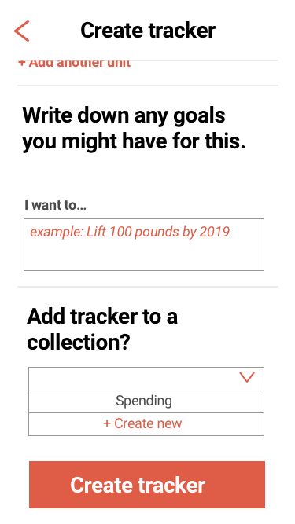
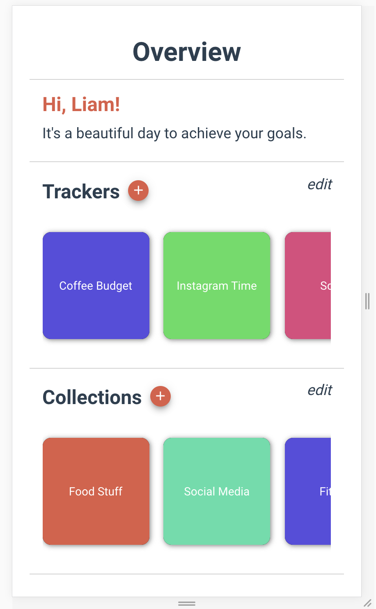
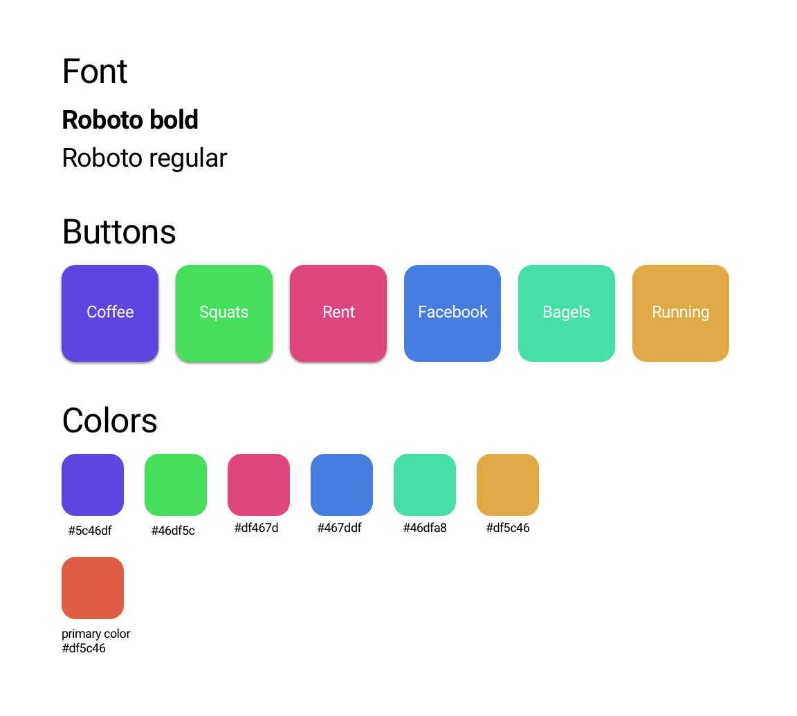

# Milestone 4 - Implementation

## Table of Contents

### Design

#### Original wireframes:

#### Planning for Implementation

Sketching out objects and components in the planning phase:

#### High Fidelities

**Home Page**

**Create Tracker**

#### Code iterations

#### Styleguide

